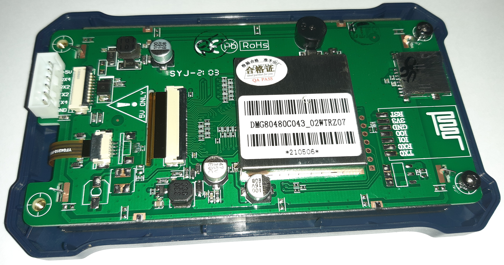

.. _DMG80480C043_02WTRZ07:

DMG80480C043_02WTRZ07 Display
=============================

Pinout
------
From right to left, when looking at the backside of the display case.

.. list-table:: Pinout Display Connector
    :header-rows: 1

    * - Pin
      - Function
    * - 1
      - +5V
    * - 2
      - RX4 (NC)
    * - 3
      - RX2
    * - 4
      - TX2
    * - 5
      - TX4 (NC)
    * - 6
      - GND
