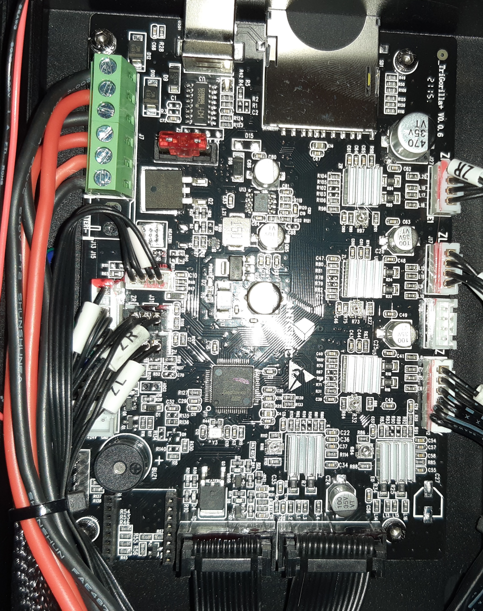

.. _trigorilla_v006_mainboard:

TriGorilla V0.0.6 Mainboard
===========================

MCU
---
The TriGorilla V0.0.6 Mainboard uses a :ref:`GD32F103<gd32f103>` MCU.

PINS
---

This PIN definitions were taken from Anycubic Firmware source.

See https://github.com/ANYCUBIC-3D/Vyper/blob/vyper/Marlin/src/pins/stm32f1/pins_AC_TRI_F1_V1.h

Used Pins:

.. csv-table:: Used Pins
    :header: "PIN", "Usage"

    End Stops
    PA7, X Axle Min
    PC6, X Axle Max
    PC5, Y Axle Min
    PB2, Z Axle Min
    Stepper X
    PC3, Stepper X Enable
    PC2, Stepper X Step
    PB9, Stepper X Direction
    Stepper Y
    PC13, Stepper Y Enable
    PB8, Stepper Y Step
    PB7, Stepper Y Direction
    Stepper Z
    PC14, Stepper Z Enable
    PB6, Stepper Z Step
    PB5, Stepper Z Direction
    Stepper E0
    PA15, Stepper E0 Enable
    PB4, Stepper E0 Step
    PB3, Stepper E0 Direction
    Stepper E1
    PC15, Stepper E1 Enable
    PC0, Stepper E1 Step
    PC1, Stepper E1 Direction
    Temperature Sensors
    PC4, Temperatur Sensor 0
    PB0, Temperatur Sensor Bed
    Heater
    PA1, Heater 0
    PA8, Heater 1
    PA4, Heater Bed
    Fans
    PA0, FAN 0
    PA14, FAN1
    Misc.
    PB15, Beeper
    PA6, Power Loss
    PA6, Power Monitor
    PA5, Filament Runout
    PA13, Case Light (LED Printing Head???)
    Autolevel
    PB13, Autolevel TX Pin
    PB12, Autolevel RX Pin
    SD-Card
    PC7, SD Card Detect
    PC8, SDIO D0
    PC9, SDIO D1
    PC10, SDIO D2
    PC11, SDIO D3
    PC12, SDIO CLK
    PD2, SDIO CMD
    

Serial Interfaces
-----------------

.. csv-table::
    :header: "No", "Usage"

    1, ???
    2, ???
    3, Display Communication
